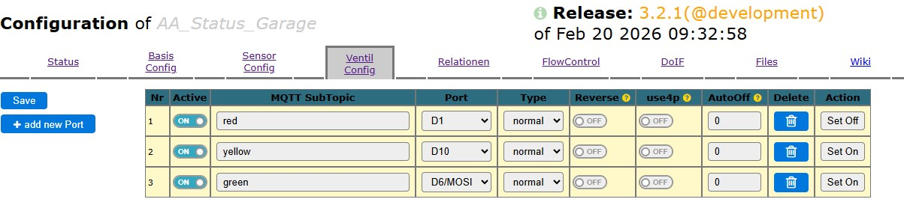
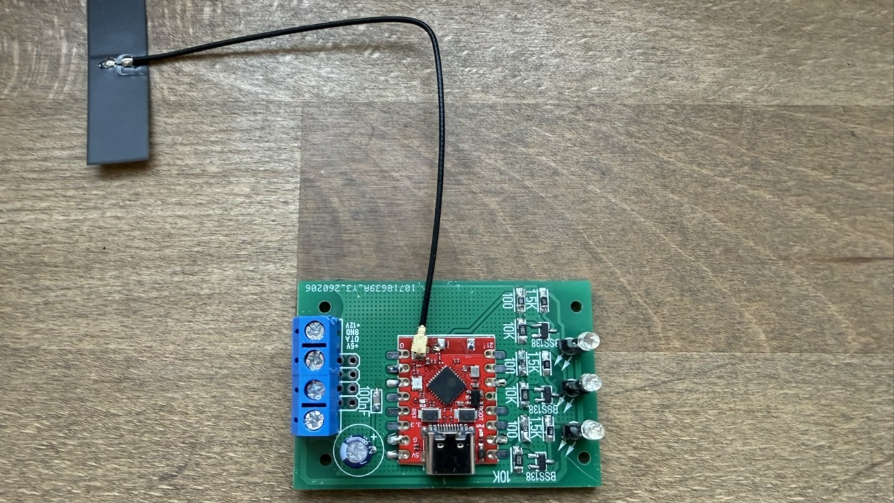

Diese Platine zeigt über 3 superhelle LED´s den Status Rot/Gelb/Grün an
Die Platine passt auf die "midi Box" im "Moritz Fuchs Elektronik" Shop: https://www.mfe24.com/de/shop/14/1/13372407/

* Version 2.4: Ansteuerung von LowCurrent LEDs direkt über einen DS2408 1wire Chip

* Version 2.5: Ansteuerung von Ultrahellen LED´s über separaten 12V Kanal über einen DS2408 1wire Chip

* Version 2.6: Ansteuerung von Ultrahellen LED´s über separaten 12V Kanal mittels ESP-C3 Super Mini. Es kann hier direkt die ESP32_Pumpcontrol Firmware benutzt werden. [Webinstaller](https://tobiasfaust.github.io/ESP32_PumpControl/)

## Konfiguration
Die Version 2.6 mit ESP32-C3 wird folgendermassen konfiguriert:

